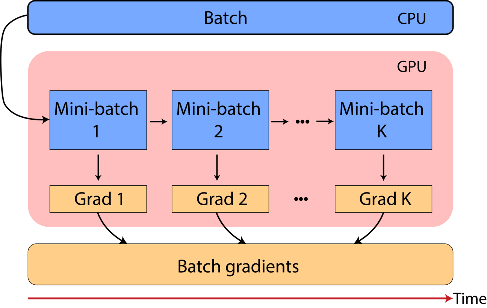

<div align="center">
<h1 align="center">GradientAccumulator</h1>
<h3 align="center">Seemless gradient accumulation for TensorFlow 2</h3>

[](https://pypi.org/project/gradient-accumulator/)
[](https://badge.fury.io/py/gradient-accumulator)
[](https://opensource.org/licenses/MIT)
[](https://doi.org/10.5281/zenodo.7806911)
[](https://github.com/andreped/GradientAccumulator/actions)
[](https://codecov.io/gh/andreped/GradientAccumulator)

**GradientAccumulator** was developed by SINTEF Health due to the lack of an easy-to-use method for gradient accumulation in TensorFlow 2.

The package is available on PyPI and is compatible with and have been tested against `TF 2.2-2.12` and `Python 3.6-3.12`, and works cross-platform (Ubuntu, Windows, macOS).
</div>


## What?
Gradient accumulation (GA) enables reduced GPU memory consumption through dividing a batch into smaller reduced batches, and performing gradient computation either in a distributing setting across multiple GPUs or sequentially on the same GPU. When the full batch is processed, the gradients are the _accumulated_ to produce the full batch gradient.

<p align="center">

</p>


## Why?
In TensorFlow 2, there did not exist a plug-and-play method to use gradient accumulation with any custom pipeline. Hence, we have implemented two generic TF2-compatible approaches:

| Method | Usage |
| - | - |
| `GradientAccumulateModel` | `model = GradientAccumulateModel(accum_steps=4, inputs=model.input, outputs=model.output)` |
| `GradientAccumulateOptimizer` | `opt = GradientAccumulateOptimizer(accum_steps=4, optimizer=tf.keras.optimizers.SGD(1e-2))` |

Both approaches control how frequently the weigths are updated, but in their own way. Approach (1) is for single-GPU only, whereas (2) supports both single-GPU and distributed training (multi-GPU). However, note that (2) is not yet working as intended. Hence, use (1) for most applications.

Our implementations enable theoretically **infinitely large batch size**, with **identical memory consumption** as for a regular mini batch. If a single GPU is used, this comes at the cost of increased training runtime. Multiple GPUs could be used to increase runtime performance.

As batch normalization is not natively compatible with GA, support for adaptive gradient clipping has been added as an alternative. We have also added support for mixed precision and both GPU and TPU support.


## Install

Stable release from PyPI:
```
pip install gradient-accumulator
```

Or from source:
```
pip install git+https://github.com/andreped/GradientAccumulator
```

## Usage
```
from gradient_accumulator import GradientAccumulateModel
from tensorflow.keras.models import Model

model = Model(...)
model = GradientAccumulateModel(accum_steps=4, inputs=model.input, outputs=model.output)
```

Then simply use the `model` as you normally would!

<details>
<summary>

#### Mixed precision</summary>

There has also been added experimental support for mixed precision:
```
from tensorflow.keras import mixed_precision
from tensorflow.keras.optimizers import Adam

mixed_precision.set_global_policy('mixed_float16')
model = GradientAccumulateModel(accum_steps=4, mixed_precision=True, inputs=model.input, outputs=model.output)

opt = Adam(1e-3, epsilon=1e-4)
opt = mixed_precision.LossScaleOptimizer(opt)
```

If using TPUs, use `bfloat16` instead of `float16`, like so:
```
mixed_precision.set_global_policy('mixed_bfloat16')
```

There is also an example of how to use gradient accumulation with mixed precision [here](https://github.com/andreped/GradientAccumulator/blob/main/tests/test_mixed_precision.py#L58).
</details>


<details>
<summary>

#### Distributed training with multiple GPUs</summary>
In order to use multiple GPUs, you will have to use the Optimizer wrapper:
```
opt = GradientAccumulateOptimizer(accum_steps=4, optimizer=tf.keras.optimizers.SGD(1e-2))
```

Just remember to wrap the optimizer within the `tf.distribute.MirroredStrategy`. For an example, see [here](https://github.com/andreped/GradientAccumulator/blob/main/tests/test_optimizer_distribute.py).

**DISCLAIMER: The GradientAccumulateOptimizer is a VERY experimental feature. It is not reaching the same results as GradientAccumulateModel with a single GPU, and does not work (yet) with multiple GPUs. Hence, I would recommend using GradientAccumulateModel with a single GPU in its current state.**

</details>


<details>
<summary>

#### HuggingFace :hugs:</summary>
Note that HuggingFace provides a variety of different pretrained models. However, it was observed that when loading these models into TensorFlow, the computational graph may not be set up correctly, such that the `model.input` and `model.output` exist.

To fix this, we basically wrap the model into a new `tf.keras.Model`, but define the inputs and outputs ourselves:
```
from gradient_accumulator import GradientAccumulateModel
from tensorflow.keras.layers import Input
from tensorflow.keras.models import Model
from transformers import TFx

#load your model checkpoint
HF_model = TFx.from_pretrained(checkpoint)

# define model inputs and outputs -> for different models, different inputs/outputs need to be defined
input_ids = tf.keras.Input(shape=(None,), dtype='int32', name="input_ids")
attention_mask = tf.keras.Input(shape=(None,), dtype='int32', name="attention_mask")
model_input={'input_ids': input_ids, 'attention_mask': attention_mask}

#create a new Model which has model.input and model.output properties
new_model = Model(inputs=model_input, outputs=HF_model(model_input))

#create the GA model
model = GradientAccumulateModel(accum_steps=4, inputs=new_model.input, outputs=new_model.output)
```
  
For more details, see [this](https://github.com/andreped/GradientAccumulator/blob/main/notebooks/GA_for_HuggingFace_TF_models.ipynb) jupyter notebook.

</details>


<details>
<summary>

#### Adaptive gradient clipping</summary>

There has also been added support for adaptive gradient clipping, based on [this](https://github.com/sayakpaul/Adaptive-Gradient-Clipping) implementation:
```
model = GradientAccumulateModel(accum_steps=4, use_agc=True, clip_factor=0.01, eps=1e-3, inputs=model.input, outputs=model.output)
```

The hyperparameters values for `clip_factor` and `eps` presented here are the default values.
</details>


<details>
<summary>

#### Model format</summary>

It is recommended to use the SavedModel format when using this implementation. That is because the HDF5 format is only compatible with `TF <= 2.6` when using the model wrapper. However, if you are using older TF versions, both formats work out-of-the-box. The SavedModel format works fine for all versions of TF 2.x.
</details>


<details>
<summary>

#### macOS compatibility</summary>
Note that GradientAccumulator is perfectly compatible with macOS, both with and without GPUs. In order to have GPU support on macOS, you will need to install the tensorflow-compiled version that is compatible with metal:
```
pip install tensorflow-metal
```

GradientAccumulator can be used as usually. However, note that there only exists one tf-metal version, which should be equivalent to TF==2.5.
</details>


<details>
<summary>

#### TF 1.x</summary>
For TF 1, I suggest using the AccumOptimizer implementation in the [H2G-Net repository](https://github.com/andreped/H2G-Net/blob/main/src/utils/accum_optimizers.py#L139) instead, which wraps the optimizer instead of overloading the train_step of the Model itself (new feature in TF2).
</details>


<details>
<summary>

#### TF >= 2.11 legacy option</summary>
Note that for TensorFlow >= 2.11, there has been some major changes to the Optimizer class. Our current implementation is not compatible with the new one. Based on which TensorFlow version you have, our `GradientAccumulateOptimizer` dynamically chooses which Optimizer to use.

However, you will need to choose a legacy optimizer to use with the Optimizer wrapper, like so:
```
import tensorflow as tf
from gradient_accumulator import GradientAccumulateOptimizer

opt = tf.keras.optimizers.legacy.SGD(learning_rate=1e-2)
opt = GradientAccumulateOptimizer(optimizer=opt, accum_steps=4)
```
</details>


<details>
<summary>

#### PyTorch</summary>
For PyTorch, I would recommend using [accelerate](https://pypi.org/project/accelerate/). HuggingFace :hugs: has a great tutorial on how to use it [here](https://huggingface.co/docs/accelerate/usage_guides/gradient_accumulation).

However, if you wish to use native PyTorch and you are implementing your own training loop, you could do something like this:
```
# batch accumulation parameter
accum_iter = 4

# loop through enumaretad batches
for batch_idx, (inputs, labels) in enumerate(data_loader):

    # extract inputs and labels
    inputs = inputs.to(device)
    labels = labels.to(device)

    # passes and weights update
    with torch.set_grad_enabled(True):
        
        # forward pass 
        preds = model(inputs)
        loss  = criterion(preds, labels)

        # scale loss prior to accumulation
        loss = loss / accum_iter

        # backward pass
        loss.backward()

        # weights update and reset gradients
        if ((batch_idx + 1) % accum_iter == 0) or (batch_idx + 1 == len(data_loader)):
            optimizer.step()
            optimizer.zero_grad()
```
</details>


<details>
<summary>

#### Troubleshooting</summary>

Overloading of `train_step` method of tf.keras.Model was introduced in TF 2.2, hence, this code is compatible with TF >= 2.2.

Also, note that TF depends on different python versions. If you are having problems getting TF working, try a different TF version or python version.
</details>


<details>
<summary>

#### Disclaimer</summary>
In theory, one should be able to get identical results for batch training and using gradient accumulation. However, in practice, one may observe a slight difference. One of the cause may be when operations are used (or layers/optimizer/etc) that update for each step, such as Batch Normalization. It is **not** recommended to use BN with GA, as BN would update too frequently. However, you could try to adjust the `momentum` of BN (see [here](https://keras.io/api/layers/normalization_layers/batch_normalization/)).

It was also observed a small difference when using adaptive optimizers, which I believe might be due to how frequently they are updated. Nonetheless, for the optimizers, the difference was quite small, and one may approximate batch training quite well using our GA implementation, as rigorously tested [here](https://github.com/andreped/GradientAccumulator/tree/main/tests)).
</details>
  

## Acknowledgements
The gradient accumulator model wrapper is based on the implementation presented in [this thread](https://stackoverflow.com/a/66524901) on stack overflow. The adaptive gradient clipping method is based on [the implementation by @sayakpaul](https://github.com/sayakpaul/Adaptive-Gradient-Clipping).
The optimizer wrapper is derived from [the implementation by @fsx950223 and @stefan-falk](https://github.com/tensorflow/addons/pull/2525).

  
## How to cite?
If you used this package or found the project relevant in your research, please, considering including the following citation:

```
@software{andre_pedersen_2023_7806911,
  author       = {André Pedersen and David Bouget},
  title        = {andreped/GradientAccumulator: v0.3.2},
  month        = apr,
  year         = 2023,
  publisher    = {Zenodo},
  version      = {v0.3.2},
  doi          = {10.5281/zenodo.7806911},
  url          = {https://doi.org/10.5281/zenodo.7806911}
}
```
